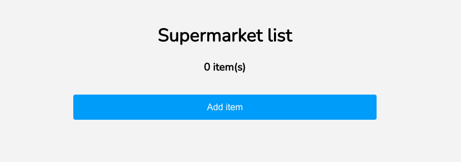
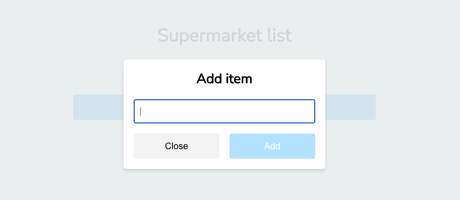
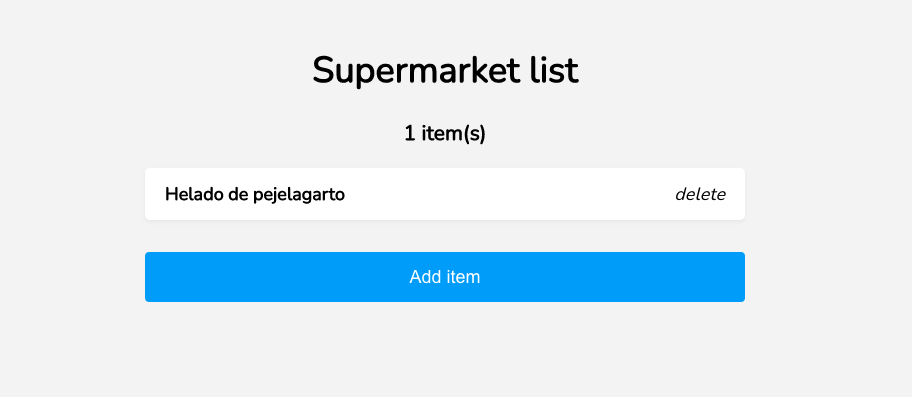

En el camino desde mi casa al supermercado, mi cerebro pierde la capacidad de retener información, por ende necesito hacer una aplicación que se encargue de esa difícil tarea. No, no puedo usar Google Keep, Evernote, nada, soy dev, la tengo que hacer, además esto es un challenge así que agarrá la pala.

### La aplicación debe:
* Mostrar un formulario para agregar elementos a la lista.
* Poder borrar cada elemento de la lista independientemente.
* Mantener los elementos de la lista cuando vuelvo a la aplicación después de cerrarla.

> En caso de guardar los datos solo en `localStorage`, se debe simular un delay al cargar, guardar y borrar los elementos, como si interactuaramos con un servicio externo.

### Es necesario:
* Cumplir con las reglas de linting del .eslintrc
* Tipar el item de lista de supermercado.
* Cumplir con las especificaciones visuales.

### Es muy importante:
* Pensar en la experiencia de usuario, minimizar la cantidad de interacciónes necesarias para usar la aplicación.
* Ser ordenada/o a la hora de codear y estructurar archivos. Keep it simple.

### No es necesario, pero suma:
* Tipar todos los elementos que usa la aplicación.
* Agregar tests unitarios, con jest para funciones, con react-testing-library para componentes.
* Agregar tests de integración, con Cypress o afínes.

Cualquier adicional que contribuya a la aplicación sin complicarla, suma, dark mode por ejemplo.

### Se puede usar:
* Cualquier solución de estilos integrada o de fácil integración con `create-react-app` (CSS Modules, CSS Plano, SASS).

### Modalidad de entrega:
* Repositorio público subido a GitHub, Gitlab, Bitbucket.
* Link a la aplicación funcionando.

### Ejemplos:
> 
> 
> 
